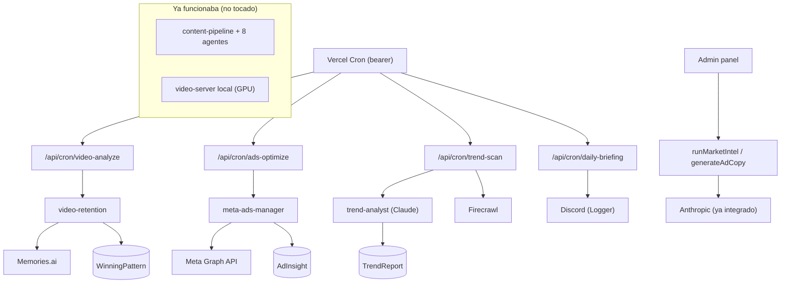

# DYD — Roadmap Automation · Handoff

Branch: `roadmap-automation`. Todo el **código** del roadmap quedó escrito, tipado y compilando (`tsc` 0 errores + `next build` verde). La **funcionalidad de las integraciones pagas no está probada** — eso requiere tus keys y lo probamos juntos.

> Principio respetado: **no se tocó el pipeline de contenido ni el video-server local que ya funcionan.** Todo lo nuevo es aditivo. fal.ai entra como proveedor OPCIONAL (`VIDEO_PROVIDER=fal`), no reemplaza nada.

---

## Qué se construyó

| Fase | Pieza | Archivos |
|---|---|---|
| Seguro (sin costo) | market-intel + ad-copy | `agents/market-analyst.ts`, `agents/ad-copywriter.ts`, `actions/intel/*` |
| 2 — Retención | análisis de video + patrones ganadores | `lib/ai/memories.ts`, `services/video-retention.ts`, `services/winning-patterns.ts` |
| 2 — Scraping | competencia | `lib/scraping/firecrawl.ts`, `services/competitor-scraper.ts` |
| 3 — Meta Ads | campañas + insights + optimize | `lib/meta/client.ts`, `lib/meta/campaigns.ts`, `services/meta-ads-manager.ts` |
| 1 — Video cloud | fal.ai (opcional) | `lib/ai/fal.ts`, `services/video-fal.ts` |
| 5 — Tendencias | trend scan | `agents/trend-analyst.ts`, `services/trend-scan.ts` |
| 6 — Briefing | Discord diario | `services/daily-briefing.ts` |
| Crons | 4 endpoints | `app/api/cron/{video-analyze,ads-optimize,trend-scan,daily-briefing}/route.ts` |
| DB | 4 tablas | `prisma/schema.prisma`: `VideoAnalysis`, `WinningPattern`, `AdInsight`, `TrendReport` |
| Infra | crons + env | `vercel.json`, `src/lib/env.ts`, `.env.example` |

---

## TU PARTE (lo que yo no puedo hacer)

### 1. Decisión / dinero
Reabrir DYD revierte el kill del 24-may. Las integraciones pagas tienen costo recurrente y chocan con tu regla de no-nueva-deuda. Decide si las activas.

### 2. Migración de la base de datos
Las 4 tablas nuevas existen en el schema pero **no están en la DB**. Con la DB arriba:
```bash
npx prisma migrate dev --name roadmap_automation   # local
# o en prod: npx prisma migrate deploy
```

### 3. Cuentas + keys (todas opcionales; rellena solo lo que actives)
| Servicio | Para qué | Costo aprox |
|---|---|---|
| fal.ai (`FAL_KEY`) | video cloud | ~$3/video 720p |
| Memories.ai (`MEMORIES_AI_API_KEY`) | retención de video | $15/mes |
| Firecrawl (`FIRECRAWL_API_KEY`) | scraping competencia | $19/mes |
| Meta Ads (`META_ACCESS_TOKEN`, `META_AD_ACCOUNT_ID`, `META_FB_PAGE_ID`) | campañas | + presupuesto de ads |

Pon las keys en `.env` (local) y en Vercel (prod). Plantilla completa en `.env.example`.

### 4. Vercel cron secret
Los crons en `vercel.json` se autentican con bearer. En Vercel define la env var **`CRON_SECRET` con el MISMO valor que `CONTENT_CRON_SECRET`**. Sin eso, los crons devuelven 401.
> Nota: el plan Hobby de Vercel limita la frecuencia/cantidad de crons. Si hay tope, deja los 1-2 más valiosos (`trend-scan`, `daily-briefing`).

### 5. Deploy
`npm run build` corre `prisma migrate deploy` y necesita DB accesible. En Vercel apunta `POSTGRES_PRISMA_URL` / `POSTGRES_URL_NON_POOLING` a un Postgres hosteado.

---

## Cómo probar cuando tengas las keys

| Feature | Prueba |
|---|---|
| market-intel / ad-copy | Botón en admin (server actions `runMarketIntel`, `generateAdCopy`) — solo necesita `ANTHROPIC_API_KEY` (ya la tienes) |
| trend-scan | `POST /api/cron/trend-scan` con `Authorization: Bearer <CONTENT_CRON_SECRET>` |
| video-analyze | igual, `/api/cron/video-analyze` (necesita `MEMORIES_AI_API_KEY`) |
| ads-optimize | igual, `/api/cron/ads-optimize` (necesita Meta) |
| daily-briefing | igual, `/api/cron/daily-briefing` → llega a Discord |

Las rutas devuelven `{ skipped: "...key no configurada" }` si falta la key — no rompen.

---

## Arquitectura (nuevo en verde, existente intacto)



---

## Lo que falta (decisión tuya, no código)
- Cablear `getTopPatterns()` dentro del scriptwriter para cerrar el loop self-improving (1 línea cuando decidas).
- Wirear botones en el admin UI para market-intel / ad-copy (las server actions ya existen).
- Poll de resultados de fal.ai (el submit ya guarda `videoJobId`).
